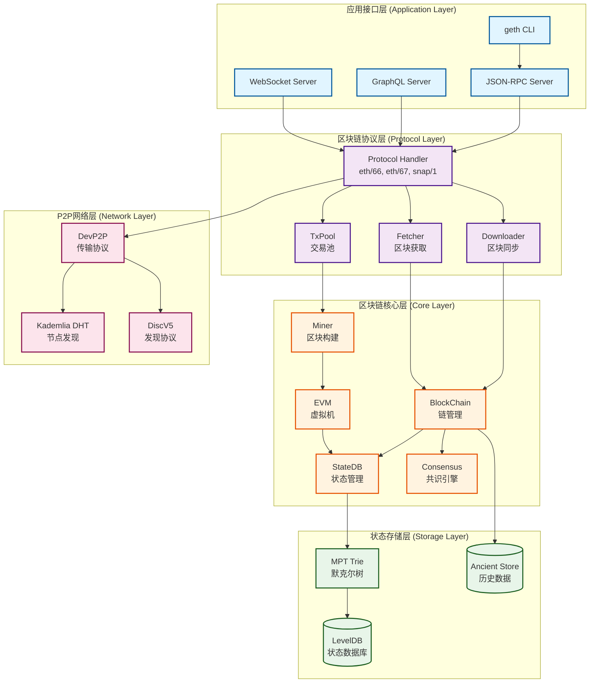

# Geth 架构图表

本目录包含 Go-Ethereum 的各种架构图和流程图，均使用 Mermaid 格式绘制。

> **提示**: 在 GitHub 上查看本文件，所有图表会自动渲染。如果在本地查看，推荐使用支持 Mermaid 的 Markdown 编辑器（如 VS Code + Mermaid 插件）。

---

## 1. 五层架构图

展示 Geth 的完整分层架构，从应用层到网络层的5层结构。



**说明**:
- **应用接口层**: 提供用户交互接口（CLI、RPC、GraphQL、WebSocket）
- **区块链协议层**: 处理 P2P 协议、区块同步、交易池管理
- **区块链核心层**: 实现区块链逻辑、状态管理、EVM 执行、共识验证
- **状态存储层**: 使用 MPT 树存储状态，LevelDB 持久化，Ancient Store 存历史数据
- **P2P网络层**: 实现节点发现（Kademlia DHT）和数据传输（DevP2P）

---

## 2. 交易生命周期流程图

展示一笔交易从提交到最终确认的完整生命周期（10个阶段）。


**关键阶段**:
1. **提交广播**: 用户签名 → RPC/P2P 广播
2. **验证分类**: 签名/nonce/余额验证 → Pending/Queue 分类
3. **排序执行**: Gas 价格排序 → EVM 执行
4. **打包共识**: 构造区块 → PoW 挖矿或 PoS 验证
5. **插入确认**: 写入数据库 → 广播 → 等待确认

---

## 3. 状态存储模型

展示以太坊的 World State 树形结构，包括账户、代码、存储的组织方式。


**存储层级**:
- **StateRoot**: 全局状态树根，记录在区块头
- **Account**: 每个地址有4个字段（Balance, Nonce, CodeHash, StorageRoot）
- **Code**: 合约字节码（通过 CodeHash 引用）
- **Storage Trie**: 合约状态存储（每个合约独立的树）
- **LevelDB**: 底层 Key-Value 数据库

**MPT节点类型**:
- **Branch Node**: 16个子节点（hex）+ 1个值槽
- **Extension Node**: 共享前缀压缩
- **Leaf Node**: 键值对终点
- **Hash Node**: 32字节哈希引用（懒加载）

---

## 4. Snap Sync 协议流程

展示 Snap Sync 快照同步的消息交互流程（时序图）。


**性能优势**:
- **并行下载**: 多个账户范围同时请求（3-5倍提升）
- **快照获取**: 直接下载 Pivot 点状态（跳过早期执行）
- **后台修复**: Merkle 树在后台重建（不阻塞同步）
- **Merkle 证明**: 验证数据完整性（无需信任 Peer）

**对比传统 Fast Sync**:
- Fast Sync: 6-12小时
- Snap Sync: 2-4小时
- 提升: 3-5倍

---

## 5. EVM 执行流程

展示 EVM 执行交易的详细流程，包括所有操作码类型和状态管理。


**执行步骤**:
1. **初始化**: 创建 BlockContext, TxContext, StateDB
2. **准备**: 根据交易类型创建 Contract 对象
3. **分配 Gas**: 扣除 gasLimit × gasPrice
4. **解释执行**: 循环读取操作码 → 检查 Gas → 执行 → 更新状态
5. **状态提交**: 成功则更新 StateDB，失败则回滚
6. **返回结果**: 返回值、Gas 使用量、错误信息

**EVM 优化**:
- **EIP-2929**: 冷/热访问 Gas 差异（冷2100，热100）
- **EIP-2200**: SSTORE Gas 退款机制
- **调用深度限制**: 最大1024层（防止栈溢出攻击）

---

## 如何查看图表

### 方法1: GitHub 在线查看（推荐）

直接在 GitHub 仓库中打开本 README.md 文件，所有 Mermaid 图表会自动渲染。

### 方法2: VS Code 插件

```bash
# 安装 Mermaid 插件
code --install-extension bierner.markdown-mermaid

# 在 VS Code 中打开本文件，使用 Markdown 预览即可
```

### 方法3: 在线编辑器

访问 [Mermaid Live Editor](https://mermaid.live/)，复制对应的 `.mmd` 文件内容即可实时编辑和预览。

### 方法4: 生成 SVG/PNG 图片

```bash
# 安装 mermaid-cli
npm install -g @mermaid-js/mermaid-cli

# 生成 SVG
mmdc -i architecture.mmd -o architecture.svg
mmdc -i transaction-lifecycle.mmd -o transaction-lifecycle.svg
# ... 对所有 .mmd 文件执行
```

---

## 源文件列表

所有图表的 Mermaid 源码也保存为独立的 `.mmd` 文件，便于编辑和版本控制：

- `architecture.mmd` - 五层架构图源码（75行）
- `transaction-lifecycle.mmd` - 交易生命周期源码（78行）
- `state-storage.mmd` - 状态存储模型源码（69行）
- `sync-protocol.mmd` - Snap Sync 流程源码（69行）
- `evm-execution.mmd` - EVM 执行流程源码（142行）

---

## 相关文档

- 理论分析: [docs/01-theoretical-analysis.md](../docs/01-theoretical-analysis.md)
- 架构设计: [docs/02-architecture-design.md](../docs/02-architecture-design.md)
- 实践验证: [docs/03-practical-verification.md](../docs/03-practical-verification.md)

---

**最后更新**: 2024年11月
