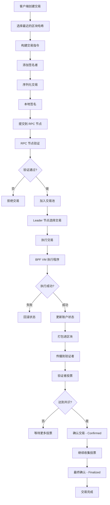
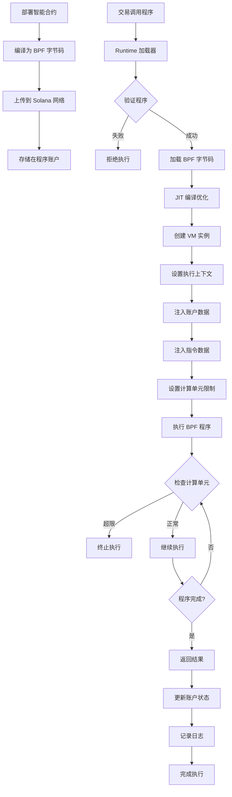
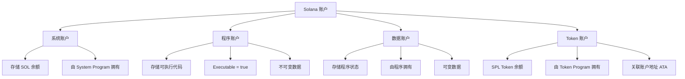
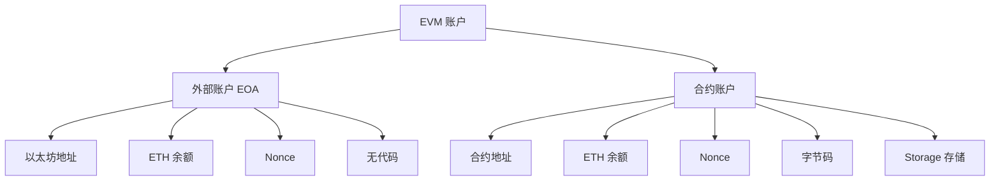
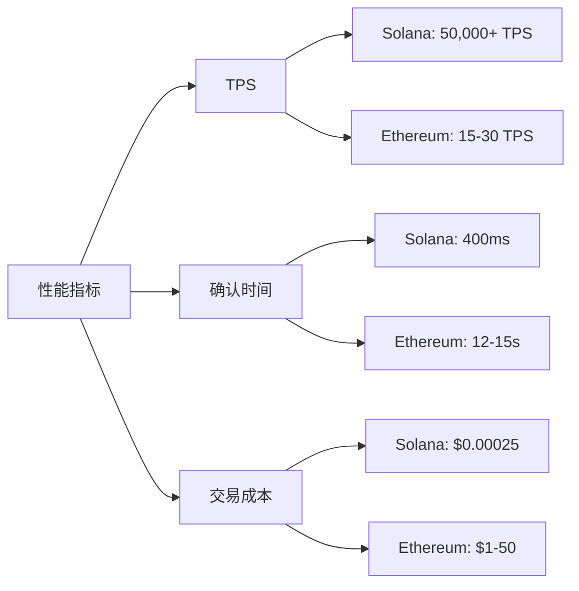
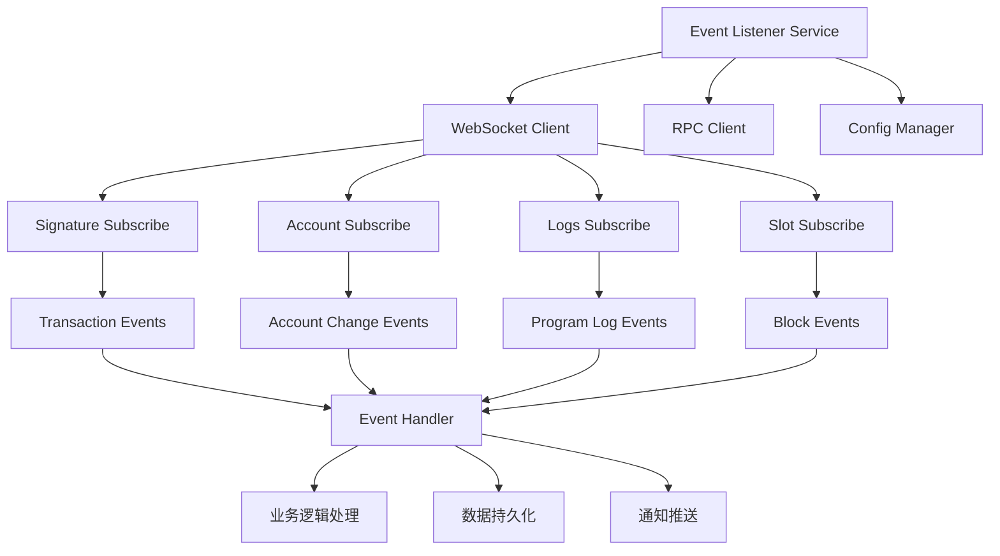
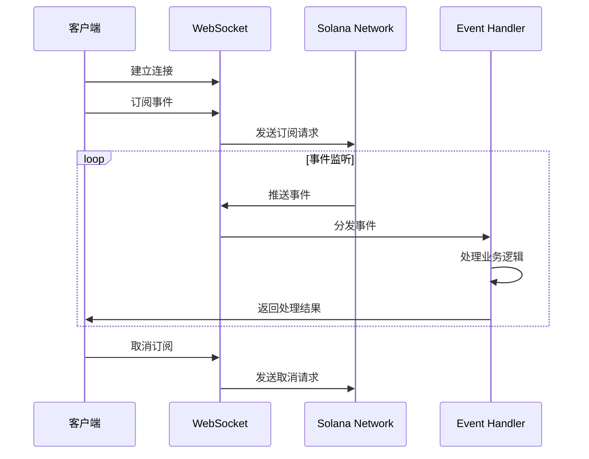

# Solana 技术报告

## 目录
1. [Solana 交易生命周期流程图](#1-solana-交易生命周期流程图)
2. [BPF 加载器工作原理图](#2-bpf-加载器工作原理图)
3. [账户存储模型对比（vs EVM）](#3-账户存储模型对比vs-evm)
4. [事件监听服务实现](#4-事件监听服务实现)
5. [智能合约开发](#5-智能合约开发)

---

## 1. Solana 交易生命周期流程图



### 详细说明

#### 1.1 交易创建阶段
- **获取最近区块哈希**：作为交易的生命周期标识，防止重放攻击
- **构建指令**：包含程序 ID、账户列表、指令数据
- **签名**：使用私钥对交易进行签名

#### 1.2 交易提交阶段
- **RPC 验证**：检查签名、余额、账户权限
- **进入交易池**：等待被 Leader 选择

#### 1.3 交易执行阶段
- **BPF VM 执行**：在 Berkeley Packet Filter 虚拟机中运行
- **状态更新**：修改账户数据和余额
- **计算单元消耗**：限制交易复杂度

#### 1.4 交易确认阶段
- **Confirmed**：被大多数验证者确认（约 2/3 投票）
- **Finalized**：被超级多数确认且不可逆（32 个区块后）

---

## 2. BPF 加载器工作原理图



### BPF 加载器详解

#### 2.1 程序部署
- **BPF 编译**：将 Rust/C/Go 代码编译为 BPF 字节码
- **程序账户**：字节码存储在可执行账户中
- **升级机制**：通过 BPF Upgradeable Loader 支持程序升级

#### 2.2 加载器类型
1. **BPF Loader v1**：早期版本，不可升级
2. **BPF Loader v2**：改进版本
3. **BPF Upgradeable Loader**：支持升级和版本控制

#### 2.3 执行环境
- **沙箱隔离**：每个程序在独立的 VM 实例中运行
- **计算单元**：限制程序执行时间（默认 200,000 CU）
- **内存限制**：防止内存溢出攻击

#### 2.4 安全机制
- **字节码验证**：确保代码安全性
- **栈深度限制**：防止栈溢出
- **只读/可写权限**：严格的账户访问控制

---

## 3. 账户存储模型对比（vs EVM）

### 3.1 架构对比表

| 特性 | Solana | Ethereum (EVM) |
|------|--------|----------------|
| **账户模型** | UTXO + 账户混合模型 | 账户模型 |
| **状态存储** | 账户直接存储数据 | 合约存储槽（Storage Slots） |
| **代码与数据分离** | ✅ 分离（程序账户 + 数据账户） | ❌ 合约账户包含代码和数据 |
| **并行执行** | ✅ 支持（通过账户锁定） | ❌ 全局状态串行执行 |
| **租金机制** | ✅ 需要支付租金或保持最低余额 | ❌ 一次性存储费用 |
| **账户所有权** | 明确的 Owner 字段 | 合约自管理 |
| **交易费用** | 基于签名数量和计算单元 | 基于 Gas 消耗 |

### 3.2 Solana 账户模型



#### Solana 账户结构
```rust
pub struct Account {
    pub lamports: u64,        // 账户余额（最小单位）
    pub data: Vec<u8>,        // 存储的数据
    pub owner: Pubkey,        // 拥有该账户的程序
    pub executable: bool,     // 是否可执行
    pub rent_epoch: u64,      // 租金纪元
}
```

### 3.3 EVM 账户模型



#### EVM 账户结构
```solidity
struct Account {
    uint256 nonce;           // 交易计数
    uint256 balance;         // ETH 余额
    bytes32 storageRoot;     // 存储树根
    bytes32 codeHash;        // 代码哈希
}
```

### 3.4 关键区别

#### 3.4.1 程序与数据分离
**Solana**：
- 程序（代码）存储在独立的程序账户中
- 状态数据存储在由程序拥有的数据账户中
- 一个程序可以管理多个数据账户

```
[Token Program] ─── owns ──→ [User A Token Account]
                └── owns ──→ [User B Token Account]
                └── owns ──→ [User C Token Account]
```

**Ethereum**：
- 代码和数据都存储在同一个合约账户中
- 每个合约实例都包含完整的代码副本

#### 3.4.2 并行执行能力
**Solana**：
- 交易必须声明读写的账户
- 不冲突的交易可以并行执行
- 通过 Sealevel 运行时实现并行

**Ethereum**：
- 全局状态树，串行执行
- 交易按顺序处理
- 并行能力有限

#### 3.4.3 租金机制
**Solana**：
- 账户需要支付租金以保持活跃
- 租金豁免：保持 2 年租金的最低余额
- 防止状态膨胀

**Ethereum**：
- 一次性存储费用
- 状态可能无限增长
- EIP-4844 尝试解决数据可用性问题

### 3.5 性能对比



---

## 4. 事件监听服务实现

### 4.1 架构设计



### 4.2 实现特性

#### 4.2.1 支持的订阅类型
1. **SignatureSubscribe**：监听特定交易的确认状态
2. **AccountSubscribe**：监听账户状态变化
3. **LogsSubscribe**：监听程序日志输出
4. **SlotSubscribe**：监听新区块生成

#### 4.2.2 高可用特性
- ✅ 自动重连机制
- ✅ 错误处理和日志记录
- ✅ 优雅停止（Graceful Shutdown）
- ✅ 配置化管理

### 4.3 使用示例

```go
// 创建事件监听器
cfg, _ := config.LoadConfig("config.yaml")
listener, _ := NewEventListener(cfg)

// 订阅交易签名
signature := solana.MustSignatureFromBase58("transaction_signature")
listener.SubscribeSignature(signature)

// 订阅账户变化
account := solana.MustPublicKeyFromBase58("account_address")
listener.SubscribeAccount(account)

// 订阅程序日志
program := solana.MustPublicKeyFromBase58("program_id")
listener.SubscribeLogs(program)

// 订阅区块更新
listener.SubscribeSlot()
```

### 4.4 事件处理流程



---

## 5. 智能合约开发

### 5.1 使用 Anchor 框架

Anchor 是 Solana 最流行的智能合约开发框架，提供：
- 简化的账户验证
- 自动序列化/反序列化
- IDL（接口定义语言）生成
- 客户端库自动生成

### 5.2 Token Swap 合约示例

#### 5.2.1 项目结构
```
token-swap/
├── programs/
│   └── token-swap/
│       ├── src/
│       │   ├── lib.rs          # 主程序入口
│       │   ├── instructions/   # 指令处理
│       │   └── state/          # 状态定义
│       └── Cargo.toml
├── tests/
│   └── token-swap.ts
├── migrations/
└── Anchor.toml
```

#### 5.2.2 合约功能
1. **初始化流动性池**
2. **添加流动性**
3. **移除流动性**
4. **代币交换**
5. **查询池信息**

### 5.3 Go 语言绑定

使用 Anchor 生成 Go 客户端代码：

```bash
# 生成 Go 绑定
anchor generate --lang=go --path=./programs/token-swap

# 目录结构
token-swap-go/
├── accounts.go      # 账户结构
├── instructions.go  # 指令构建
└── types.go        # 类型定义
```

### 5.4 客户端集成示例

```go
package main

import (
    "context"
    "github.com/gagliardetto/solana-go"
    tokenswap "path/to/token-swap-go"
)

func main() {
    // 初始化流动性池
    poolAccount := solana.NewAccount()
    
    ix := tokenswap.NewInitializeInstruction(
        tokenA,
        tokenB,
        poolAccount.PublicKey(),
        feeNumerator,
        feeDenominator,
    ).Build()
    
    // 构建并发送交易
    // ...
}
```

---

## 6. 总结

### 6.1 Solana 核心优势
1. **高性能**：50,000+ TPS
2. **低延迟**：400ms 区块时间
3. **低成本**：平均交易费用 $0.00025
4. **并行执行**：通过账户模型实现真正的并行
5. **PoH 共识**：历史证明 + PoS 的创新组合

### 6.2 技术挑战
1. **学习曲线**：账户模型与 EVM 差异大
2. **状态管理**：需要手动管理账户租金
3. **工具生态**：相比以太坊仍在发展中
4. **网络稳定性**：历史上曾出现过网络中断

### 6.3 应用场景
- ✅ 高频交易（DEX）
- ✅ GameFi 和 NFT
- ✅ 支付和结算
- ✅ DeFi 协议
- ✅ Web3 社交应用

---

## 参考资料

1. [Solana 官方文档](https://docs.solana.com/)
2. [Anchor 框架](https://www.anchor-lang.com/)
3. [Solana Cookbook](https://solanacookbook.com/)
4. [Solana Program Library](https://spl.solana.com/)
5. [Solana Go SDK](https://github.com/gagliardetto/solana-go)
